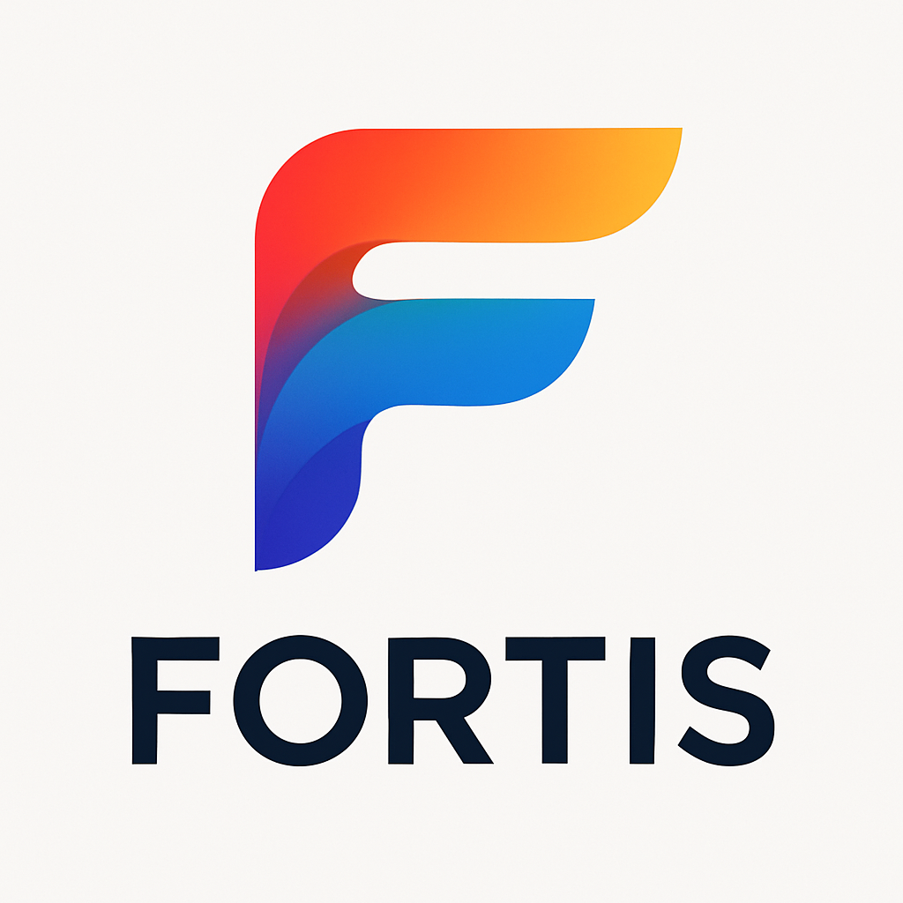

# Fortis

Fortis is a mobile fitness tracking app built with React Native and Supabase. It allows users to create, log, and manage custom and auto-generated workouts based on fitness level, goals, and available equipment.

## Features

* Supabase authentication and profile management
* Onboarding flow to capture fitness level and goal
* Custom workout logging with sets, reps, and weights
* Auto-generated workouts based on:

  * Muscle groups
  * Selected equipment
  * Fitness level and goal
* Local workout storage using AsyncStorage
* Workout history display
* Personal record tracking
* Clean UI using Material 3 design system

## Tech Stack

* React Native with Expo
* Supabase (Auth and Database)
* AsyncStorage
* PostgreSQL (via Supabase)

## Project Structure

```
src/
├── components/          # Reusable UI components
├── context/             # Global state (AppContext, WorkoutContext)
├── screens/             # Auth, onboarding, dashboard, and workout flows
├── utils/               # AsyncStorage logic, theme, and helpers
├── supabase/            # Supabase client setup
```

## Supabase Schema

### profiles

| Column         | Type        |
| -------------- | ----------- |
| id             | uuid        |
| username       | text        |
| fitness\_level | text        |
| goal           | text        |
| created\_at    | timestamptz |

### workouts

| Column        | Type        |
| ------------- | ----------- |
| id            | uuid        |
| user\_id      | uuid        |
| date          | date        |
| intensity     | int         |
| muscle\_group | text        |
| totalVolume   | int         |
| created\_at   | timestamptz |

### workout\_exercises

| Column       | Type        |
| ------------ | ----------- |
| id           | uuid        |
| workout\_id  | uuid        |
| exercise\_id | text        |
| sets         | int         |
| reps         | int         |
| weight       | int         |
| created\_at  | timestamptz |

### exercises

| Column     | Type |
| ---------- | ---- |
| id         | text |
| name       | text |
| target     | text |
| equipment  | text |
| body\_part | text |
| gif\_url   | text |


## Example User Flow

1. User signs up or logs in via Supabase Auth
2. Onboarding flow asks for fitness level and goal
3. User selects custom or generated workout path
4. User logs workout data (sets, reps, weights)
5. Workout and exercise logs are saved to Supabase and AsyncStorage
6. Dashboard shows recent workouts and progress stats

## Environment

* Node.js >= 18
* Expo SDK 53+
* Supabase CLI (for optional local development/testing)

```
# Install Supabase CLI (optional)
npm install -g supabase
```

## Running Locally

```bash
npx expo start
```


